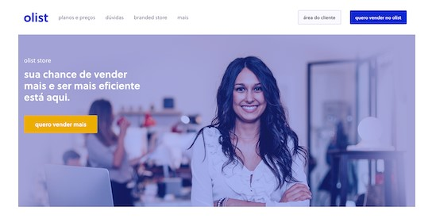

<h1>Projet 5: Segmentez des clients d'un site e-commerce</h1>
  

<h2>Contexte et problématique du projet</h2>

Vous êtes consultant pour Olist, une entreprise brésilienne qui propose une solution de vente sur les marketplaces en ligne.

Olist souhaite que vous fournissiez à ses équipes d'e-commerce une segmentation des clients qu’elles pourront utiliser au quotidien pour leurs campagnes de communication.

Votre objectif est de comprendre les différents types d’utilisateurs grâce à leur comportement et à leurs données personnelles.

Vous devrez fournir à l’équipe marketing une description actionable de votre segmentation et de sa logique sous-jacente pour une utilisation optimale, ainsi qu’une proposition de contrat de maintenance basée sur une analyse de la stabilité des segments au cours du temps.

<h2>But et intérêt du projet</h2>

Faire une segmentation des clients avec des méthodes non supervisées pour regrouper des clients de profils similaires à partir des données Olist : https://www.kaggle.com/olistbr/brazilian-ecommerce

- Analyse des données pour sélectionner les variables pertinentes dans un jeu de données peu fourni
- Réalisation d'un clustering
- La segmentation proposée doit être exploitable et facile d’utilisation par notre équipe Marketing. Elle doit au minimum pouvoir différencier les bons et moins bons clients en termes de commandes et de satisfaction. Nous attendons bien sûr une segmentation sur l’ensemble des clients.
- Une fois le modèle de segmentation choisi, réalisation d'une recommandation de fréquence à laquelle la segmentation doit être mise à jour pour rester pertinente, afin de pouvoir effectuer un devis de contrat de maintenance.
- Le code Python fourni doit respecter la convention PEP8, pour être utilisable par Olist.

<h2>Compétences évaluées</h2>

- Mettre en place le modèle d'apprentissage non supervisé adapté au problème métier
- Transformer les variables pertinentes d'un modèle d'apprentissage non supervisé
- Adapter les hyperparamètres d'un algorithme non supervisé afin de l'améliorer
- Évaluer les performances d’un modèle d'apprentissage non supervisé

<h2>Contenu du dépôt GitHub</h2>

- README.md: fichier présentation projet

- olist.jpg : image illustration README.md

- Répertoire "Notebooks":
  - fichier "POLIST_01_notebookanalyse.ipynb": fichier notebook Jupyter en Python pour l'analyse des données
  - fichier "POLIST_02_notebookessais-echantillonnage_avec_categ_prod.ipynb": fichier notebook Jupyter en Python pour les pistes de modélisation avec prise en compte des catégories de produit
  - fichier "POLIST_03_notebookessais-echantillonnage_sans_categ_prod.ipynb": fichier notebook Jupyter en Python pour les pistes de modélisation sans prise en compte des catégories de produit
  
- Répertoire "Soutenance":
  - fichier "POLIST_04_support_soutenance_ppt.ppt": fichier support soutenance projet Powerpoint
  - fichier "POLIST_04_support_soutenance_pdf.pdf": fichier support soutenance projet PDF
  - fichier "projet_p5_oc_ds.mp4": video soutenance projet P5 (mp4)
  - fichier "Projet 5 valide - Segmentez des clients d'un site e-commerce - OC.pdf": preuve de validation du projet P5